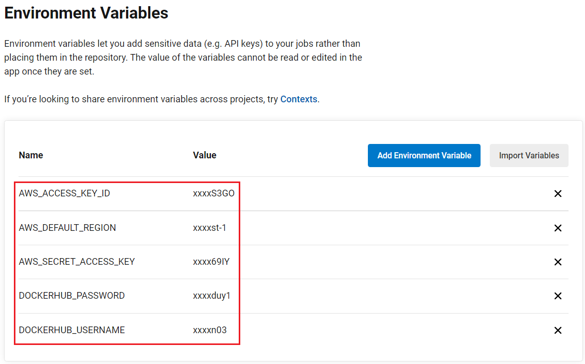

# Cloud DevOps Engineer Capstone Project

## Overview
The pipeline including:

* Working in AWS
* HelloWorld nginx
* Using Circle CI to implement Continuous Integration and Continuous Deployment
* Building Docker image
* Deploy to Kubernetes clusters

## The tasks
Using a CI/CD approach, I built a Docker image and use Kubernetes cluster to deploy the HelloWorld application.

Main tasks
- Linting using html_linter and Hadolint to check the sytnax of the HTML file and Dockerfile.
- Build a Docker Image and push to DockerHub to containerized application
- Create Kubernetes cluster on AWS using eksctl.
- Deploy application on Kubernetes
- Using a rolling-update strategy to update application

#### Note CicleCI Variables
I set up the following environment variables in My CircleCI project with values:

* AWS_ACCESS_KEY_ID: IAM user with admin permission
* AWS_SECRET_ACCESS_KEY: IAM user with admin permission
* AWS_DEFAULT_REGION: us-east-1
* DOCKERHUB_USERNAME: dockerhub username
* DOCKERHUB_PASSWORD: dockerhub password

### Folder structure
* [index.html](./HelloWorld/index.html): the HelloWorld html file 
* [Dockerfile](./HelloWorld/Dockerfile): the Docker image's specification file
* [Makefile](./HelloWorld/Makefile): the file to run install dependencies of the app and the lint test

* [config.yml](.circleci/config.yml): to build the CI/CD pipeline in CircleCI

* [cloudFormations](.circleci/cloudFormations): contain files to create eks cluster
* [deployApp](.circleci/deployApp): contain files to deploy application to eks cluster